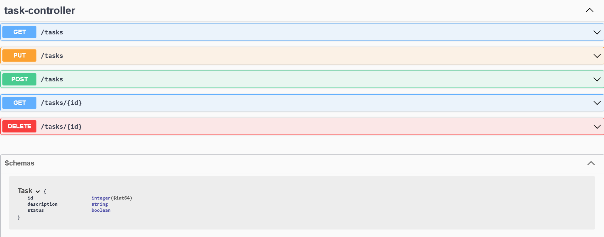

Projeto feito para o desafio : Publicando Sua API REST na Nuvem Usando Spring Boot 3, Java 17 e Railway

Foi desenvolvida uma API simples de tarefas usando o armazenamento em memória com o H2. O projeto contem um CRUD completo para o gerenciamento de tasks via API, conforme apresentado na imagem abaixo. 
    
